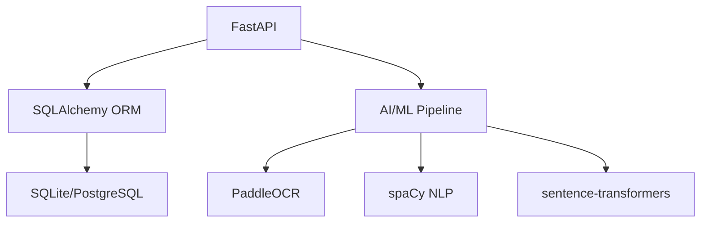
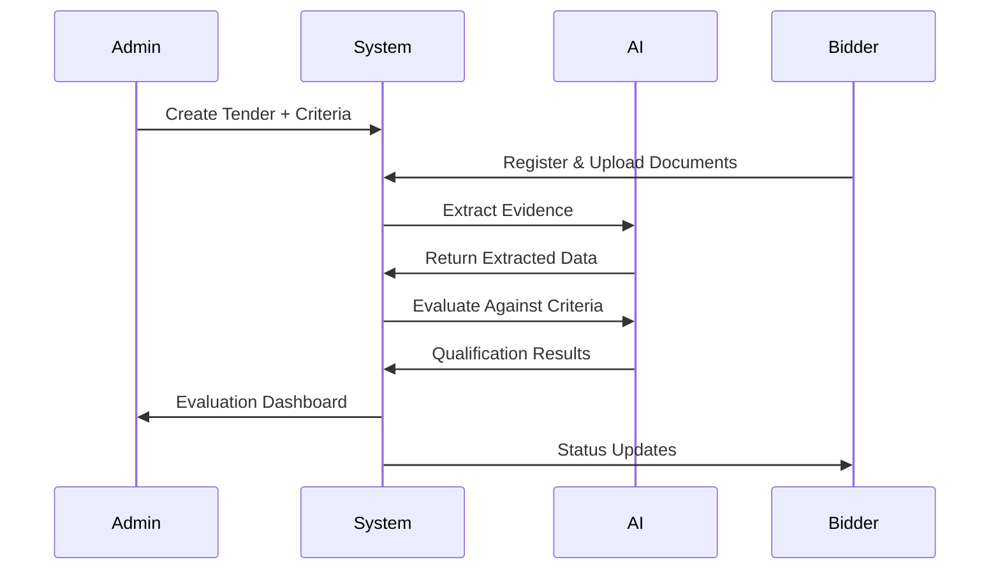

# 🚀 AI Tender Evaluation System

<div align="center">


[](https://github.com/RakeshKumar625/AI_Tender)
[](https://github.com/RakeshKumar625/AI_Tender)
[](LICENSE)

**Revolutionizing Tender Evaluation with AI for CRPF Procurement**

[📖 Documentation](#-documentation) • [🚀 Quick Start](#-quick-start) • [🎯 Key Features](#-key-features) • [🛠️ Technology Stack](#-technology-stack)

---

</div>

##  Overview

Welcome to the **AI Tender Evaluation System** - an intelligent, automated solution designed specifically for the **Central Reserve Police Force (CRPF)** procurement processes. This cutting-edge platform leverages advanced **AI/ML technologies** to transform traditional manual tender evaluation into a streamlined, accurate, and transparent digital workflow.

> **"Transforming procurement from paperwork to intelligence-driven decisions"**

---

##  Key Features

###  AI-Powered Intelligence
- ** Advanced OCR**: Multi-engine text extraction from PDFs, DOCX, and images using PaddleOCR + Tesseract
- ** NLP Processing**: Intelligent document analysis with spaCy and sentence transformers
- ** Automated Evaluation**: Smart qualification assessment against complex criteria
- ** Precision Matching**: Context-aware evidence extraction and validation

###  Multi-Role Architecture
- ** Admin Dashboard**: Complete tender lifecycle management and oversight
- ** Bidder Portal**: Seamless registration, document submission, and status tracking
- ** Real-time Updates**: Live status monitoring and notification system

###  Enterprise-Grade Security
- ** Role-Based Access**: Granular permissions for admins and bidders
- ** JWT Authentication**: Secure, stateless authentication system
- ** Audit Trail**: Comprehensive activity logging and compliance tracking
- ** Manual Review**: Human oversight for complex evaluation cases

###  Analytics & Reporting
- ** Performance Metrics**: Detailed evaluation statistics and insights
- ** Custom Reports**: Flexible reporting for procurement analysis
- ** Data Visualization**: Interactive charts and dashboards

---

## 🛠️ Technology Stack

<div align="center">

### Backend Architecture


| Component | Technology | Purpose |
|-----------|------------|---------|
| **Framework** |  | High-performance async API |
| **Database** |  | ORM & Database Operations |
| **OCR Engine** |  | Document Text Extraction |
| **NLP** |  | Natural Language Processing |
| **AI/ML** |  | Text Similarity & Embeddings |

### Frontend Architecture
| Component | Technology | Purpose |
|-----------|------------|---------|
| **Framework** |  | Modern UI Framework |
| **Language** |  | Type-Safe Development |
| **Build Tool** |  | Fast Development Server |
| **Styling** |  | Utility-First CSS |
| **Routing** |  | Client-Side Navigation |
| **Charts** |  | Data Visualization |

</div>

---

## 📁 Project Structure

```
🗂️ AI_Tender/
├── 🔧 backend/                    # FastAPI Backend
│   ├──  routers/               # API Endpoints
│   │   ├──  auth.py            # Authentication
│   │   ├──  upload.py          # File Upload
│   │   ├──  extract.py         # Document Processing
│   │   ├──  evaluate.py        # AI Evaluation
│   │   └──  report.py          # Analytics
│   ├──  models.py              # Database Models
│   ├──  auth.py                # Auth Logic
│   ├──  database.py            # DB Config
│   └──  requirements.txt       # Dependencies
├──  frontend/                   # React Frontend
│   ├──  src/
│   │   ├──  components/        # UI Components
│   │   ├──  pages/            # Page Components
│   │   ├──  context/          # State Management
│   │   └──  App.tsx           # Main App
│   └──  package.json          # Dependencies
├──  README.md                  # Documentation
└──  .gitignore                # Git Ignore Rules
```

---

##  Quick Start

###  Prerequisites
-  Python 3.11 or higher
-  Node.js 18 or higher
-  Git for version control

###  Installation & Setup

#### 1. Clone the Repository
```bash
git clone https://github.com/RakeshKumar625/AI_Tender.git
cd AI_Tender
```

#### 2. Backend Setup
```bash
# Navigate to backend
cd backend

# Create virtual environment
python -m venv venv
source venv/bin/activate  # Windows: venv\Scripts\activate

# Install dependencies
pip install -r requirements.txt

# Start development server
uvicorn main:app --reload --host 0.0.0.0 --port 8000
```

#### 3. Frontend Setup
```bash
# Open new terminal and navigate to frontend
cd frontend

# Install dependencies
npm install

# Start development server
npm run dev
```

#### 4. Database Initialization
```bash
# In backend directory (with venv activated)
python create_admin.py  # Create admin user
python seed_companies.py  # Optional: Seed sample data
```

###  Access the Application
- **Frontend**: http://localhost:5173
- **Backend API**: http://localhost:8000
- **API Documentation**: http://localhost:8000/docs

---

##  Documentation

### API Reference
Once the backend is running, explore the interactive API documentation:
- **Swagger UI**: `http://localhost:8000/docs`
- **ReDoc**: `http://localhost:8000/redoc`

### System Architecture


---

##  Demo & Screenshots

<div align="center">

### Admin Dashboard
*Coming Soon - Tender Management Interface*

### Bidder Portal
*Coming Soon - Document Upload & Status Tracking*

### AI Evaluation Results
*Coming Soon - Automated Qualification Assessment*

</div>

---

##  Contributing

We welcome contributions! Please see our [Contributing Guidelines](CONTRIBUTING.md) for details.

### Development Workflow
1.  **Fork** the repository
2.  **Create** a feature branch: `git checkout -b feature/amazing-feature`
3.  **Develop** your feature
4.  **Test** thoroughly
5.  **Commit** changes: `git commit -m 'Add amazing feature'`
6.  **Push** to branch: `git push origin feature/amazing-feature`
7.  **Open** a Pull Request

### Code Standards
-  **Linting**: ESLint for frontend, Black for backend
-  **Testing**: Write tests for new features
-  **Documentation**: Update docs for API changes
-  **Commits**: Use conventional commit messages

---

## 📄 License

This project is licensed under the **MIT License** - see the [LICENSE](LICENSE) file for details.

**Developed exclusively for CRPF procurement processes.**

---

##  Contact & Support

<div align="center">

**Got questions? We'd love to hear from you!**

[](https://linkedin.com/in/rakeshkumar625)
[](https://github.com/RakeshKumar625)
[](mailto:rakesh@example.com)

**Rakesh Kumar** - *Project Lead & Developer*

---

** Star this repository if you find it useful!**

*Made with for efficient and transparent procurement processes*

</div>
